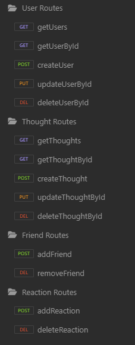

# Social Network API - Example

This is an example backend API for a social network platform using a NoSQL database.

## How to Use 

Clone the repo from GitHub, open your CLI in the root folder of the repo, and run `npm i` to install the required dependencies.

---
Built with [Node.js](https://nodejs.org/en), [Express](https://expressjs.com/), and [Mongoose](https://mongoosejs.com/)